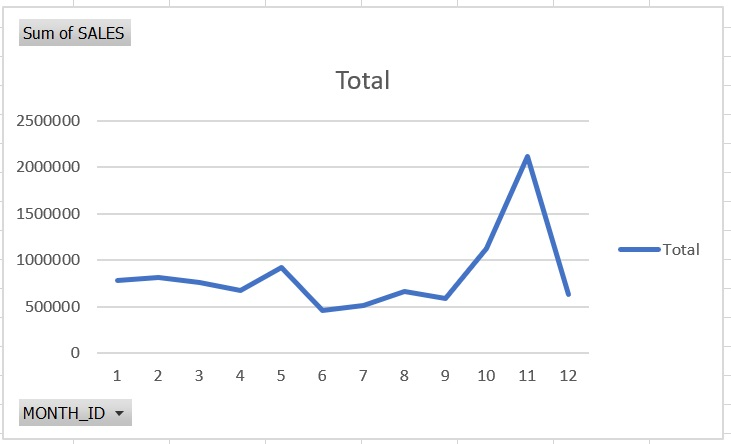
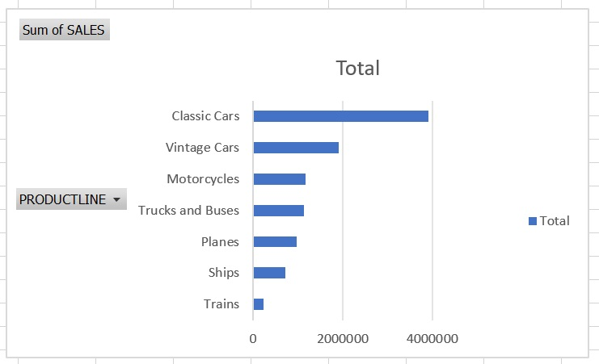
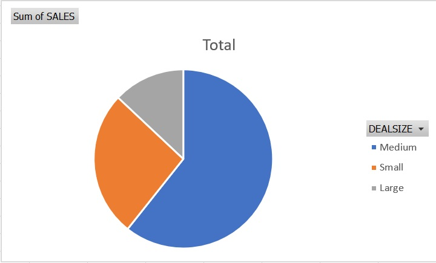

# 📊 Sales Performance Dashboard (Excel)

An Excel-based dashboard project that analyzes sales trends using pivot tables and charts.

## 📂 Dataset

- `sales_data_sample.csv`
- 2,823 records of sales by region, product line, and deal size

## 🔧 Tools

- Microsoft Excel
- GitHub (for hosting)

## 📊 Pivot Tables and Charts

1. Monthly Sales Trend (Line Chart)
2. Sales by Product Line (Bar Chart)
3. Sales by Deal Size (Pie Chart)

## 📷 Screenshots

  
  

## 🔍 Key Insights

- **Classic Cars** dominate revenue
- **Large deals** yield highest sales
- **Q2 & Q4** are peak performance periods

## 🧠 Skills Demonstrated

- Pivot Table Analysis
- Chart Visualization
- Business Insight Communication
- GitHub Project Documentation
